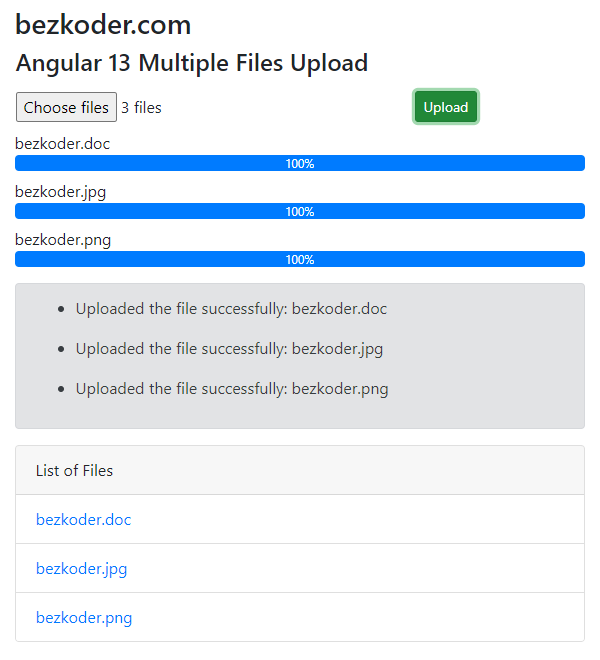

# Angular 13 Multiple File upload example with Progress bar

In this tutorial, I will show you way to build Multiple Files upload example using Angular 13, Bootstrap and FormData with Progress Bars.

For more detail, please visit:
> [Angular 13 Multiple Files upload example with Progress bar & Bootstrap](https://www.bezkoder.com/angular-13-multiple-file-upload/)

> [Angular 13 Multiple Images upload with Preview example](https://www.bezkoder.com/angular-13-image-upload-preview/)

Rest APIs server for this Angular Client:
> [Node Express File Upload Rest API example](https://www.bezkoder.com/node-js-express-file-upload/)

> [Node Express File Upload with Google Cloud Storage example](https://www.bezkoder.com/google-cloud-storage-nodejs-upload-file/)

> [Node Express File Upload to MongoDB example](https://www.bezkoder.com/node-js-upload-store-images-mongodb/)

> [Spring Boot Multipart File upload (to static folder) example](https://www.bezkoder.com/spring-boot-file-upload/)

> [Spring Boot Multipart File upload (to database) example](https://www.bezkoder.com/spring-boot-upload-file-database/)

More practice:
> [Angular with Firebase Storage: File Upload/Display/Delete example](https://www.bezkoder.com/angular-13-firebase-storage/)

> [Angular CRUD Application example with Web API](https://www.bezkoder.com/angular-13-crud-example/)

> [Angular JWT Authentication & Authorization with Web API](https://www.bezkoder.com/angular-12-jwt-auth/)

> [Angular Pagination example with ngx-pagination](https://www.bezkoder.com/angular-12-pagination-ngx/)

Fullstack with Node Express:
> [Angular + Node Express + MySQL example](https://www.bezkoder.com/angular-12-node-js-express-mysql/)

> [Angular + Node Express + PostgreSQL example](https://www.bezkoder.com/angular-12-node-js-express-postgresql/)

> [Angular + Node Express + MongoDB example](https://www.bezkoder.com/angular-12-mongodb-node-js-express/)

> [Angular + Node Express: File upload example](https://www.bezkoder.com/angular-12-node-js-file-upload/)

> [Angular + Node Express: JWT Authentication and Authorization example](https://www.bezkoder.com/node-js-angular-12-jwt-auth/)

Fullstack with Spring Boot:
> [Angular + Spring Boot + H2 Embedded Database example](https://www.bezkoder.com/spring-boot-angular-13-crud/)

> [Angular + Spring Boot + MySQL example](https://www.bezkoder.com/spring-boot-angular-13-mysql/)

> [Angular + Spring Boot + PostgreSQL example](https://www.bezkoder.com/spring-boot-angular-13-postgresql/)

> [Angular + Spring Boot + MongoDB example](https://www.bezkoder.com/angular-13-spring-boot-mongodb/)

> [Angular + Spring Boot: File upload example](https://www.bezkoder.com/angular-12-spring-boot-file-upload/)

> [Angular + Spring Boot: JWT Authentication and Authorization example](https://www.bezkoder.com/angular-12-spring-boot-jwt-auth/)

Fullstack with Django:
> [Angular + Django example](https://www.bezkoder.com/django-angular-12-crud-rest-framework/)

> [Angular + Django + MySQL](https://www.bezkoder.com/django-angular-mysql/)

> [Angular + Django + PostgreSQL](https://www.bezkoder.com/django-angular-postgresql/)

Serverless with Firebase:
> [Angular 13 Firebase CRUD with Realtime DataBase | AngularFireDatabase](https://www.bezkoder.com/angular-13-firebase-crud/)

> [Angular 13 Firestore CRUD example with AngularFireStore](https://www.bezkoder.com/angular-13-firestore-crud-angularfirestore/)

> [Angular 13 Firebase Storage: File Upload/Display/Delete example](https://www.bezkoder.com/angular-13-firebase-storage/)

Integration (run back-end & front-end on same server/port)
> [How to integrate Angular with Node Restful Services](https://www.bezkoder.com/integrate-angular-12-node-js/)

> [How to Integrate Angular with Spring Boot Rest API](https://www.bezkoder.com/integrate-angular-12-spring-boot/)

## Development server

Run `ng serve --port 8081` for a dev server. Navigate to `http://localhost:8081/`. The app will automatically reload if you change any of the source files.

## Code scaffolding

Run `ng generate component component-name` to generate a new component. You can also use `ng generate directive|pipe|service|class|guard|interface|enum|module`.

## Build

Run `ng build` to build the project. The build artifacts will be stored in the `dist/` directory.

## Further help

To get more help on the Angular CLI use `ng help` or go check out the [Angular CLI Overview and Command Reference](https://angular.io/cli) page.
